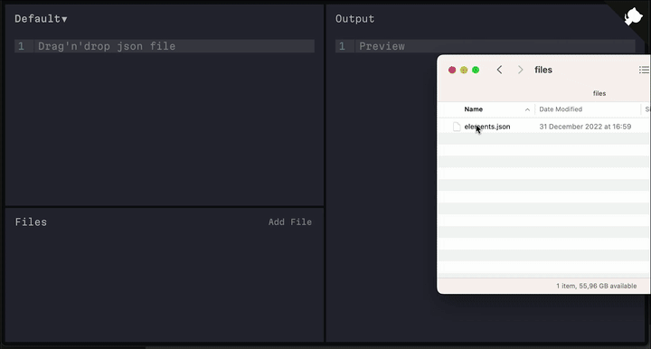

# [json-box.vercel.app](https://json-box.vercel.app)

Json Box is a simple demo app for [jota-minidb](https://github.com/11bit/jotai-minidb) — IndexedDB integration for [Jotai](https://jotai.org/).

Json Box allows you to add json files, do processing with javascript and see results in realtime.

Json files and processing code is saved to IndexedDB, that’s why all your work will be there even if you refresh the page or reopen browser (nothing is sent to server, everything is local!)

# Acknowledgements

Sample JSON files to populate db are taken from [https://github.com/dariusk/corpora](https://github.com/dariusk/corpora)
